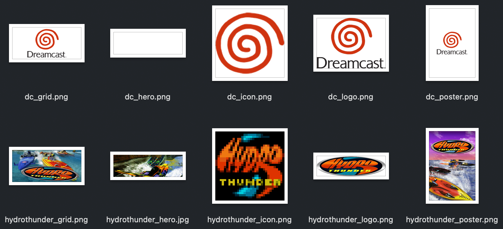
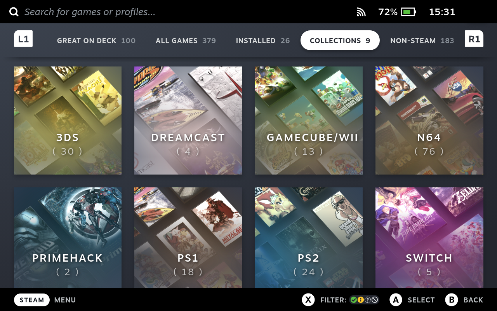

# Steam Librarian
A Steam library manager for the command line.

## Why?

I tried using Steam ROM Manager on my Steam Deck but its godawful UI, the multitudes of bugs, and its abandonware nature made it impossible to keep using it.

## Usage

**Note for Steam Deck users:** Switch to Desktop Mode for this. Yes, you *can* technically SSH into the Deck in Game Mode, but the app will actively refuse to run if Steam is also running, and you understandably can't quit Steam in Game Mode.

You can run `librarian write-example` to make the app write a whole example JSON file to stdout. If you want to work off that, skip directly to [**Writing your changes to your Steam library**](#writing-your-changes-to-your-steam-library). If you want the nitty-gritty, keep reading.

### Preparing a library JSON file

Steam Librarian needs a library JSON file to work off of, and you'll have to create one before you can use this app for realsies.
To do that, run this once: `librarian prepare -l romlibrary.json`

This is the only time you'll ever need that command.

The generated JSON file will look something like this:
<details>
<summary>[Click to show JSON]</summary>

```json
{
  "launchers": {},
  "categories": {},
  "preexistingShortcuts": [
    {
      "appID": "1234567890",
      "appName": "Example Game"
    }
  ]
}
```

**Note:** Don't mess with the entries in the `preexistingShortcuts` list, the app needs those to know which library entries to leave untouched in case you already have non-Steam entries in there.
</details>

### Adding launchers

Now, add some launchers for the games you want to play. Here's the JSON file from above, but populated with a few example entries for the Steam Deck:

<details>
<summary>[Click to show JSON]</summary>

```json
{
  "launchers": {
    "flycast": {
      "executable": "/usr/bin/flatpak",
      "arguments": "run org.flycast.Flycast"
    },
    "duckstation": {
      "executable": "/usr/bin/flatpak",
      "arguments": "run org.duckstation.DuckStation -batch -fullscreen"
    },
    "pcsx2": {
      "executable": "/usr/bin/flatpak",
      "arguments": "run --command=pcsx2-qt net.pcsx2.PCSX2 -slowboot -fullscreen --"
    },
    "xemu": {
      "executable": "/usr/bin/flatpak",
      "arguments": "run app.xemu.xemu -full-screen -dvd_path"
    },
    "simple64": {
      "executable": "/usr/bin/flatpak",
      "arguments": "run io.github.simple64.simple64 --nogui"
    },
    "dolphin": {
      "executable": "/usr/bin/flatpak",
      "arguments": "run org.DolphinEmu.dolphin-emu -b -e"
    },
    "primehack": {
      "executable": "/usr/bin/flatpak",
      "arguments": "run io.github.shiiion.primehack -b -e"
    },
    "citra": {
      "executable": "/usr/bin/flatpak",
      "arguments": "run org.citra_emu.citra"
    },
    "ryujinx": {
      "executable": "/usr/bin/flatpak",
      "arguments": "run org.ryujinx.Ryujinx"
    },
    "yuzu": {
      "executable": "/usr/bin/flatpak",
      "arguments": "run org.yuzu_emu.yuzu -f -g"
    }
  },
  "categories": {},
  "preexistingShortcuts": [
    {
      "appID": "1234567890",
      "appName": "Example Game"
    }
  ]
}
```
</details>

Adjust these as needed.

### Adding categories and entries

Let's create a new category first. Every *category* you create will become a *collection* in your Steam library.

Here's an example library with a category for the venerable Dreamcast and an associated launcher:

<details>
<summary>[Click to show JSON]</summary>

```json
{
  "launchers": {
    "flycast": {
      "executable": "/usr/bin/flatpak",
      "arguments": "run org.flycast.Flycast"
    }
  },
  "categories": {
    "Dreamcast": {
      "defaultLauncher": "flycast",
      "entries": [
        {
          "name": "Dreamcast BIOS",
          "bios": true,
          "path": "Dreamcast BIOS",
          "grid": "images/dc_grid.png",
          "poster": "images/dc_poster.png",
          "hero": "images/dc_hero.png",
          "logo": "images/dc_logo.png",
          "icon": "images/dc_icon.png"
        },
        {
          "name": "Hydro Thunder",
          "path": "/run/media/mmcblk0p1/games/dreamcast/Hydro Thunder/Hydro Thunder.gdi",
          "grid": "images/hydrothunder_grid.png",
          "poster": "images/hydrothunder_poster.png",
          "hero": "images/hydrothunder_hero.jpg",
          "logo": "images/hydrothunder_logo.png",
          "icon": "images/hydrothunder_icon.png"
        }
      ]
    }
  },
  "preexistingShortcuts": []
}
```

These are the images used in this example:


</details>

The JSON key for the category object is used for the collection's name in your Steam library. The `defaultLauncher` string must be one of the JSON keys from the `launchers` list created earlier and can be overriden for single entries by specifying an additional `launcher` string in an entry object like this:

<details>
<summary>[Click to show JSON]</summary>

```json
{
  "name": "Hydro Thunder",
  "path": "/run/media/mmcblk0p1/games/dreamcast/Hydro Thunder/Hydro Thunder.gdi",
  "launcher": "someotherlauncher",
  "grid": "images/hydrothunder_grid.png",
  "poster": "images/hydrothunder_poster.png",
  "hero": "images/hydrothunder_hero.jpg",
  "logo": "images/hydrothunder_logo.png",
  "icon": "images/hydrothunder_icon.png"
}
```
</details>

The `name` and `path` strings are self-explanatory. The others pointing to image files define what an entry will look like in Steam's UI. All of the images are optional, but specifying at least `grid` and `poster` images will make games in your library much more recognizable at a glance.

Unlike Steam ROM Manager, this app does not have an automatic SteamGridDB downloader of questionable quality. Please download your own images from https://steamgriddb.com or other sources and put them somewhere you can easily refer to in a library JSON file.

### Writing your changes to your Steam library

First, make sure Steam isn't running. The app will try to detect whether Steam is running and will exit with a message if that is the case. Then, run `librarian write -l romlibrary.json` to have the app add all entries to your Steam library. Once that's done, you can relaunch Steam.

It's possible for Steam to not immediately pick up that new collections were added or that new entries were added to already existing collections. In that case run `librarian reset` to reset your collections. This *might* wreck your own custom collections, but Steam will tell you what collections it'll keep and give you a chance to cancel before *actually* resetting all collections. (**Note:** This is currently broken on the Steam Deck. In Desktop Mode, open [`steam://resetcollections`](steam://resetcollections) in a browser instead)

**Also**, keep the JSON file around! It's how the app remembers the games you added and additionally it'll come in handy for things like…

### Adding or removing games later

To add new games, simply add new entries to the library JSON file and run `librarian write -l romlibrary.json` again.

To remove games, simply delete them from within Steam and remember to delete the corresponding entry from your library JSON file before running `librarian write` the next time.

### A note about metadata

If you open your library JSON file later, you might see stuff added by Steam Librarian like:

```json
"steamMetadataDoNotEdit": {
  "appID": "3921758550",
  "bpmAppID": "16843824715091935232",
  "lastPlayTime": "1970-01-01T01:00:00+01:00"
}
```

As the name suggests, please don't edit this. This is what ensures the app doesn't add duplicate entries.

### That's it!

